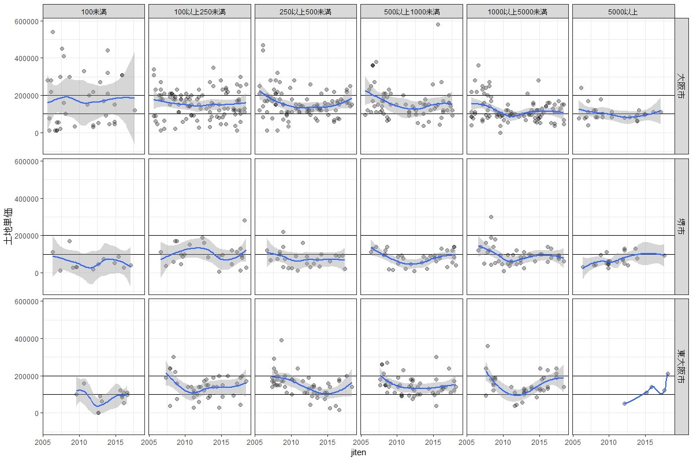

# Osaka-Kogyo-scatter-plot
取引価格情報に基づく、工業地の大阪府３市（規模別）の時点・取引単価の散布図

## データの入手方法等
国交省Hpの取引価格情報をダウンロード。
ここでは、大阪府の取引価格情報から、土地ｍ２単価が把握できる土地のみのデータを抽出し、工業地について、サンプル数の多い３市（大阪市、堺市、東大阪市）について、規模別に、時点とｍ２単価の散布図を描画し、トレンドをみる。

地積については、元データでは2000m2以上は「2000m2以上」となっているが、取引総額を取引単価で割り算して地積を求めた。また、建物付きのサンプルについては、ｍ２単価が把握できず、対象外となるいことに留意を要する。

サンプル数は下記のとおり。

|city    |100未満  |100以上250未満  |250以上500未満  |500以上1000未満  |1000以上5000未満  |5000以上|
|:--:|:--:|:--:|:--:|:--:|:--:|:--:|
|大阪市       |39             |104             |99              |68               |98        |27|
|堺市         |13              |26             |26              |35               |44        |24|
|東大阪市     |13              |39             |51              |52               |38         |5|

## 結果等
鑑定評価書等で、ある程度サンプル数があれば、価格動向を表示するのには、散布図を描画するのシンプルかつ説得力がある。Rを使うと、上記のような地積を区分するようなことも関数で容易にでき、描画もなれれば色々なパターンで即時に可能である。

大阪市・堺市は海に面し、東大阪市は内陸に位置する。大阪市・堺市では大規模な土地は臨海部に多く、近年臨海部で災害が多いことなどから、大規模な土地については、内陸部の東大阪市のほうが単価が高いもよう。

